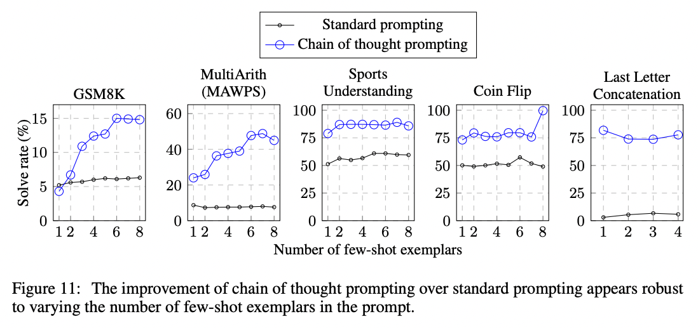
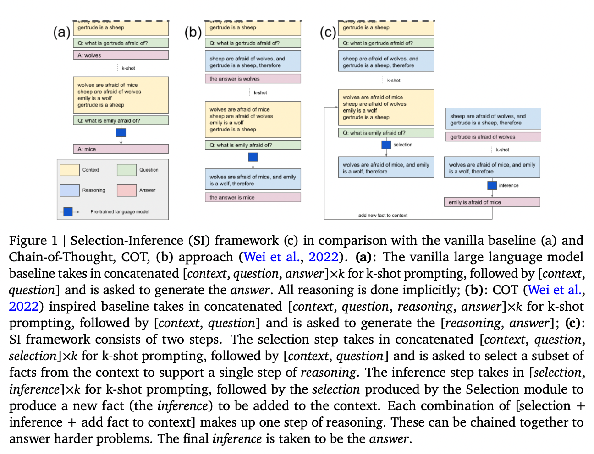
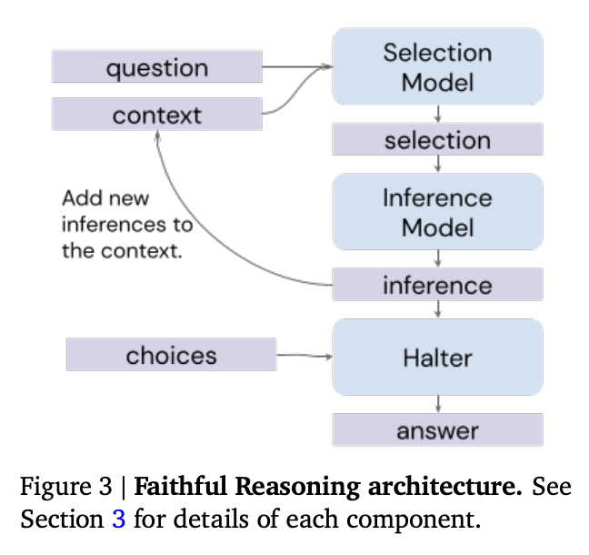
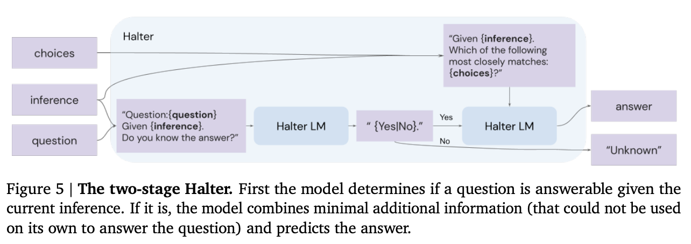
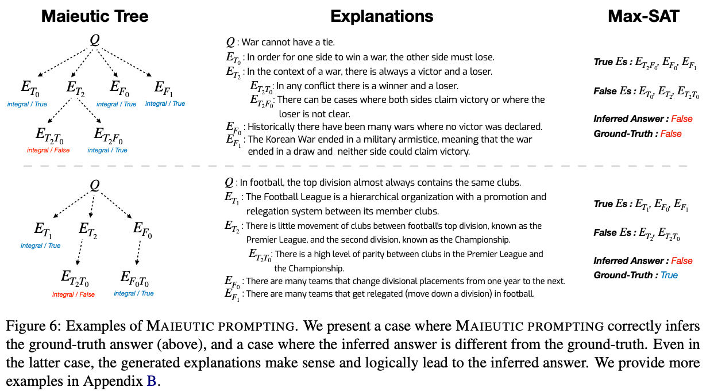
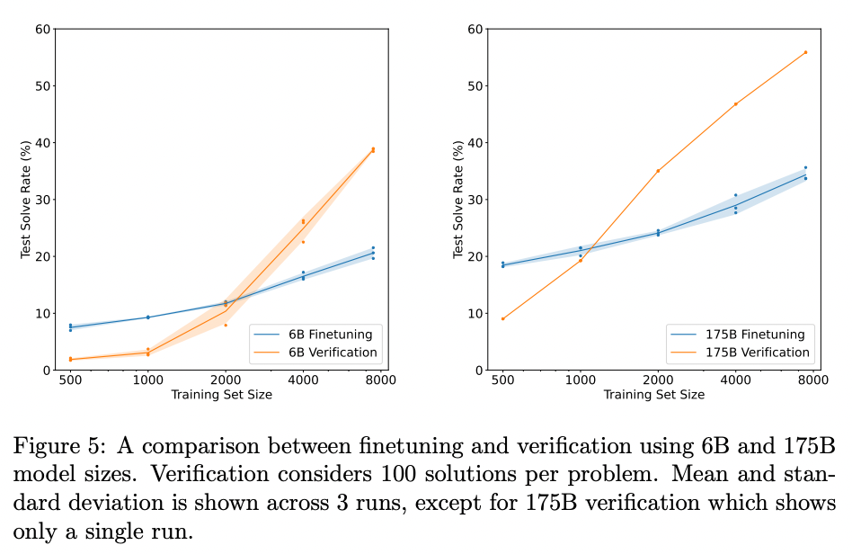
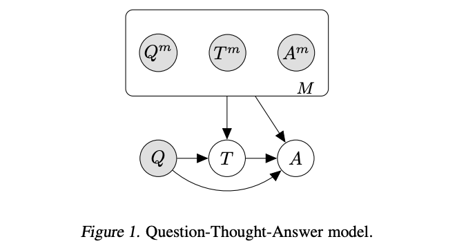
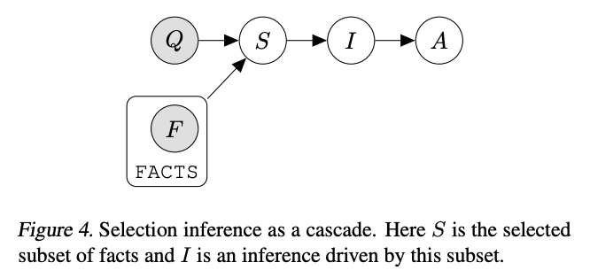
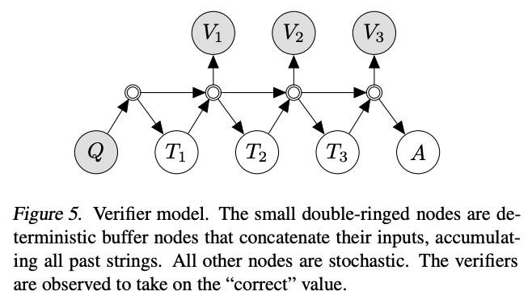

# 信頼性を向上させるテクニック

GPT-3 がタスクで失敗した場合、どうすればよいですか?

- より信頼性の高い回答を引き出すより良いプロンプトを検索しますか?
- カスタム モデルを微調整するために何千もの例に投資しますか?
- モデルがそのタスクを実行できないと仮定して、先に進みますか?

簡単な答えはありません。状況によります。 ただし、タスクに論理的な推論や複雑さが伴う場合は、この記事の手法を試して、より信頼性が高くパフォーマンスの高いプロンプトを作成することを検討してください。

## GPT-3 が複雑なタスクで失敗する理由

13 を 17 で掛けるように言われたら、すぐに答えが思い浮かびますか? 私たちのほとんどにとって、おそらくそうではありません。 とはいえ、人間が 2 桁の掛け算ができないわけではありません。 数秒と、ペンと紙があれば、13 x 17 = 130 + 70 + 21 = 221 を計算するのはそれほど難しくありません。

同様に、GPT-3 に、次のトークンを計算するのにかかる時間内に実行するには複雑すぎるタスクを与えると、誤った推測を作成する可能性があります。 それでも、人間と同じように、モデルがそのタスクを実行できないとは限りません。 物事を推論するための時間とスペースがあれば、モデルはまだ確実に答えることができるかもしれません.

例として、`text-davinci-002` にジャグリング ボールに関する次の数学の問題を尋ねると、間違った答えが返されます。

```text-davinci-002
Q: ジャグラーは 16 個のボールを持っています。 ボールの半分はゴルフ ボールで、ゴルフ ボールの半分は青色です。 青いゴルフボールは何個ありますか。
A:
```

```text-davinci-002
青いゴルフボールが8個あります。
```

これは、GPT-3 が単純な数学の問題を処理できないことを意味しますか? いいえ; 実際、モデルに「段階的に考えてみましょう」と促すことで、モデルは問題を確実に解決することがわかりました。

```text-davinci-002
Q: ジャグラーは 16 個のボールを持っています。 ボールの半分はゴルフ ボールで、ゴルフ ボールの半分は青色です。 青いゴルフボールは何個ありますか。
A: 段階的に考えてみましょう。
```

```text-davinci-002
全部で16個のボールがあります。
ボールの半分はゴルフボールです。
つまり、ゴルフボールは8個です。
ゴルフボールの半分は青い。
つまり、青いゴルフボールが 4 個あるということです。
```

もちろん、この「段階的に考えてみましょう」というトリックが実際に一般的に機能するのか、それともこの特定の問題で運が良かっただけなのか、たった 1 つの例から判断するのは困難です。 しかし、それは本当にうまくいきます。 単語の数学の問題のベンチマークでは、「段階的に考えてみましょう」というトリックにより、GPT-3 の解決率が、役に立たない 18% からまともな 79% に大幅に上昇しました。

## モデルの機能はコンテキストに依存します

GPT-3 の使用方法を学習する際によくある概念上の間違いの 1 つは、その機能がすべてのコンテキストで固定されていると信じることです。 たとえば、GPT-3 が単純な論理の問題を間違えた場合、GPT-3 は単純な論理ができないはずです。

しかし、「段階的に考えてみましょう」の例が示すように、GPT-3 の明らかな失敗は、モデルが正しい出力に向けて進むのに役立つより良いプロンプトで修正できる場合があります。

## 複雑なタスクの信頼性を向上させる方法

この記事の残りの部分では、複雑なタスクで大規模な言語モデルの信頼性を向上させる手法について説明します。 一部の手法は特定のタイプの問題に固有のものですが、それらの多くは幅広いタスクに適用できる一般原則に基づいて構築されています。

- より明確な指示を与える
- 複雑なタスクをより単純なサブタスクに分割
- モデルの作業を継続するための指示を構造化する
- 答える前にモデルに説明を促す
- 多くの考えられる答えの正当性を尋ね、それから統合する
- 多くの出力を生成し、モデルを使用して最適なものを選択します
- カスタムモデルを微調整してパフォーマンスを最大化

## 複雑なタスクをより単純なタスクに分割する

モデルに考える時間と空間を与える 1 つの方法は、タスクをより単純な部分に分割することです。

例として、あるテキストについて多肢選択式の質問をモデルに行うタスクを考えてみましょう。この場合は手がかりのゲームです。 直接尋ねると、`text-davinci-002` は手がかり 3 と 5 を組み合わせることができず、間違って答えます。
 
```text-davinci-002
次の手がかりを使用して、次の複数選択問題に答えてください。
 
手がかり:
1. ラウンジにはミス・スカーレットしかいなかった。
2. パイプを持った人は台所にいました。
3. 天文台にいたのはマスタード大佐だけだった。
4. プラム教授は図書室にもビリヤード室にもいませんでした。
5. ローソク足を持っている人は天文台にいました。
 
質問: マスタード大佐は燭台を持って天文台にいましたか?
(a) はい; マスタード大佐は燭台を持って天文台にいた
(b) いいえ。 マスタード大佐はローソク足を持って天文台にいなかった
(c) 不明。 マスタード大佐がローソク足を持って天文台にいたかどうかを判断するのに十分な情報がない.
 
解決：
```
 
```text-davinci-002
(c) 不明。 マスタード大佐がローソク足を持って天文台にいたかどうかを判断するのに十分な情報がない.
```

手がかり 3 と 5 は、マスタード大佐が天文台にいた唯一の人物であり、天文台にいた人物がローソク足を持っていたことを立証していますが、
モデルはそれらを (a) はいの正しい答えに組み合わせることができません。
 
ただし、直接答えを求める代わりに、タスクを 3 つの部分に分割できます。
 
- まず、手がかりを 1 つずつ調べて、手がかりが潜在的に関連しているかどうかを検討します
- 次に、関連する手がかりを組み合わせて、質問に対する答えを導き出します
- 第三に、最終的な答えを書きます: (a)、(b)、または (c) のいずれか
 
```text-davinci-002
次の手がかりを使用して、次の手順を使用して、次の複数選択問題に答えてください。
(1) まず、手がかりを一つ一つ見ていき、その手がかりが潜在的に関連性があるかどうかを検討する
(2) 次に、関連する手がかりを組み合わせて、質問に対する答えを導き出します
(3) 3 番目に、(a)、(b)、または (c) のいずれかの多肢選択式の回答のいずれかに回答をマッピングします。
 
手がかり:
1. ラウンジにはミス・スカーレットしかいなかった。
2. パイプを持った人は台所にいました。
3. 天文台にいたのはマスタード大佐だけだった。
4. プラム教授は図書室にもビリヤード室にもいませんでした。
5. ローソク足を持っている人は天文台にいました。
 
質問: マスタード大佐は燭台を持って天文台にいましたか?
(a) はい; マスタード大佐は燭台を持って天文台にいた
(b) いいえ。 マスタード大佐はローソク足を持って天文台にいなかった
(c) 不明。 マスタード大佐がローソク足を持って天文台にいたかどうかを判断するのに十分な情報がない.
 
解決：
(1) まず、手がかりを 1 つずつ調べて、手がかりが潜在的に関連するかどうかを検討します。
```
 
```text-davinci-002
手がかり 1: ラウンジにはミス・スカーレットしかいませんでした。 この手がかりは関係ありません。
手がかり 2: パイプを持っている人はキッチンにいました。 この手がかりは関係ありません。
手がかり 3: マスタード大佐は天文台にいる唯一の人物でした。 この手がかりは関連しています。
手がかり 4: プラム教授は図書館にもビリヤード室にもいませんでした。 この手がかりは関係ありません。
手がかり 5: ローソク足を持っている人は天文台にいました。 この手がかりは関連しています。
 
(2) 次に、関連する手がかりを組み合わせて、質問に対する答えを導き出します。
手がかり 3 と手がかり 5 はどちらも、ローソク足を持っている人が天文台にいたことを示しています。 天文台にいるのはマスタード大佐だけだったので、ロウソク足を持っていたのはマスタード大佐だった。
 
(3) 第三に、最終的な答えを書きます。
(a) はい; マスタード大佐は燭台を持って天文台にいた
```
 
モデルに考える時間と空間を与え、推論計画に沿ってモデルを導くことで、(a) はいの正しい答えを導き出すことができます。

複雑な命令を小さなサブタスクに分割するもう 1 つの利点は、モデルを各サブタスクに集中させ続けるのに役立つことです。

たとえば、`text-davinci-002` にテキストを元の言語で要約するように依頼すると、モデルは英語に戻る可能性があります。

```text-davinci-002
テキストの元の言語を使用してテキストを要約します。 要約は 1 文の長さにする必要があります。

文章：
"""
La estadística (la forma femenina del termino alemán Statistik, derivado a su vez del italiano statista, "hombre de Estado") es una ciencia que estudia la variabilidad, colección, organización, análisis, interpretación, y presentación de los datos, así como el proceso aleatorio que los general siguiendo las leyes de la probabilidad. La estadística es una ciencia form deductiva, con un conocimiento propio, dinámico y en continuo desarrollo obtenido a través del método científico form. 必要に応じて、事実を利用するために必要な技術を確立し、事実を調査するためのプロセスを調査し、実験と観察のために新しい情報を得ることができます。 En estos casos, la aplicación de la estadística permite el análisis de datosprovinientes de una muestra Representativeativa, que busca explicar las correlaciones ydependencias de un fenómeno físico o natural, de ocurrencia en forma aleatoria o condicional.
"""

概要：
```

```text-davinci-002
このテキストでは、統計はデータの変動性、収集、編成、分析、解釈、提示、および確率の法則に従ってデータを生成するランダムなプロセスを研究する科学であると説明しています。
  ```

  ただし、最初にモデルにテキストの言語を識別してからテキストを要約するように依頼すると、より信頼性が高くなります。

```text-davinci-002
まず、テキストの言語を識別します。 次に、テキストの元の言語を使用してテキストを要約します。 要約は 1 文の長さにする必要があります。

文章：
"""
La estadística (la forma femenina del termino alemán Statistik, derivado a su vez del italiano statista, "hombre de Estado") es una ciencia que estudia la variabilidad, colección, organización, análisis, interpretación, y presentación de los datos, así como el proceso aleatorio que los general siguiendo las leyes de la probabilidad. La estadística es una ciencia form deductiva, con un conocimiento propio, dinámico y en continuo desarrollo obtenido a través del método científico form. 場合によっては、ラ

事実科学は、実験と観察に基づいて新しい知識を得るために、事実調査プロセス中に統計的手法を使用する必要があります。 これらの場合、統計の適用により、ランダムまたは条件付き発生の物理的または自然現象の相関関係と依存関係を説明しようとする代表的なサンプルからのデータの分析が可能になります。
"""

言語：
```

```text-davinci-002
英語

統計学は、データの変動性、収集、編成、分析、解釈、提示、および確率の法則に従ってデータを生成するランダムなプロセスを研究する科学です。
```

## 答える前にモデルに説明を促す

回答の信頼性を向上させるためのもう 1 つの強力な手法は、最終的な回答にすぐにジャンプするのではなく、モデルに徐々に回答を推論させることです。 「声に出して考える」ことで、モデルが正しい答えに到達する可能性がはるかに高くなります。

### ゼロショット

#### 方法

Published by [Takeshi Kojima et al. in 2022](https://arxiv.org/abs/2205.11916), モデルに答えを推論させる最も簡単な方法は、答えの前に「段階的に考えてみましょう」を単純に追加することです。図 2 に例を示します:

[
<br>出典: *Large Language Models are Zero-Shot Reasoners* by Takeshi Kojima et al. (2022).](https://arxiv.org/abs/2205.11916)

#### 結果

この単純なトリックを MultiArith 数学データセットに適用したところ、著者は「段階的に考えてみましょう」が精度を 18% から 79% へと 4 倍にしたことを発見しました!

[
<br>出典: *Large Language Models are Zero-Shot Reasoners* by Takeshi Kojima et al. (2022).](https://arxiv.org/abs/2205.11916)

#### 含意

「段階的に考えよう」というトリックは、数学の問題には有効ですが、すべてのタスクに有効というわけではありません。 著者は、多段階算術問題、記号推論問題、戦略問題、およびその他の推論問題に最も役立つことを発見しました。 単純な数学の問題や常識の問題には役に立ちませんでした。おそらく、他の多くの非論理的なタスクにも役に立たなかったでしょう。

[
<br>出典: *Large Language Models are Zero-Shot Reasoners* by Takeshi Kojima et al. (2022).](https://arxiv.org/abs/2205.11916)

詳細については、[論文全文](https://arxiv.org/abs/2205.11916)をお読みください。

この手法を自分のタスクに適用する場合、命令をカスタマイズすることを恐れないでください。「ステップバイステップで考えよう」はかなり一般的なので、ユースケースに合わせてカスタマイズされたより厳格な形式に従った指示の方が、より良いパフォーマンスを得られるかもしれません。例えば、まず、Xが真である可能性がある理由をステップバイステップで考えてください。次に、なぜYが真実なのか、順を追って考えてみてください。第三に、X と Y のどちらがより理にかなっているのかを段階的に考えてください。モデルを軌道に乗せるのに役立つサンプル形式をモデルに与えることもできます。

```text-davinci-002
以下の IRS ガイダンスを使用して、次の形式を使用して次の質問に答えてください。
(1) 各基準について、車両の購入によって満たされているかどうかを判断します
- {基準} 段階的に考えてみましょう。 {説明} {はいまたはいいえ、または質問が該当しない場合は N/A}。
(2) 各基準を順番に検討した後、最終的な答えを「{理由} により、答えは {はいまたはいいえ} である可能性が高い」と表現します。

IRS ガイダンス:
"""
次の基準を満たす車またはトラックを購入した場合、セクション 30D に基づく連邦税額控除の対象となる場合があります。
- 車両には少なくとも 4 つの車輪がありますか?
- 車両の重量は 14,000 ポンド未満ですか?
- 車両は、外部電源から再充電できる少なくとも 4 キロワット時のバッテリーからエネルギーを引き出しますか?
- 車両は 2022 年より前の年に購入されましたか?
   - もしそうなら、製造業者は 200,000 未満の適格な車両を販売しましたか? (Tesla と GM は 200,000 台以上の対象車両を販売しています。)
- 車両は 2022 年以降に購入されましたか?
   - もしそうなら、その車両は北米で組み立てられた車両の以下のリストにありますか? (北米で組み立てられている唯一の電気自動車は、アウディ Q5、BMW 330e、BMW X5、シボレー ボルト EUV、シボレー ボルト EV、クライスラー パシフィカ PHEV、フォード エスケープ PHEV、フォード F シリーズ、フォード マスタング マッハ E、フォード トランジット バン、GMC です。ハマー ピックアップ、GMC ハマー SUV、ジープ グランド チェロキー PHEV、ジープ ラングラー PHEV、リンカーン アビエイター PHEV、リンカーン コルセア プラグイン、ルシッド エア、日産リーフ、リビアン EDV、リビアン R1S、リビアン R1T、テスラ モデル 3、テスラ モデル S、テスラModel X、Tesla Model Y、Volvo S60、BMW 330e、Bolt EV、Cadillac Lyriq、Mercedes EQS SUV、Nissan Leaf)。
"""

質問: 2021 年に購入したトヨタ プリウス プライムの連邦税額控除を請求できますか?

解決：

(1) 各基準について、車両が満たしているかどうかを判断する

アイクル購入
- 車両には少なくとも 4 つの車輪がありますか? 一歩一歩考えてみましょう。
```

```text-davinci-002
  トヨタ プリウス プライムは 4 輪なので、答えはイエスです。
- 車両の重量は 14,000 ポンド未満ですか? 一歩一歩考えてみましょう。 トヨタ プリウス プライムの重量は 14,000 ポンド未満なので、答えはイエスです。
- 車両は、外部電源から再充電できる少なくとも 4 キロワット時のバッテリーからエネルギーを引き出しますか? 一歩一歩考えてみましょう。 トヨタ プリウス プライムには、外部電源から再充電できる少なくとも 4 キロワット時のバッテリーが搭載されているため、答えはイエスです。
- 車両は 2022 年より前の年に購入されましたか? 一歩一歩考えてみましょう。 トヨタ プリウス プライムは 2022 年より前の 2021 年に購入されたので、答えはイエスです。
- 車両は 2022 年以降に購入されましたか? なし
- もしそうなら、その車両は北米で組み立てられた車両の以下のリストにありますか? なし

(2) 各基準を順番に検討した後、最終的な答えを「{理由} により、答えは {はいまたはいいえ} である可能性が高い」と表現します。

トヨタ プリウス プライムは、連邦税額控除のすべての基準を満たしているため、答えはおそらくイエスです。
```

### いくつかの例

#### 方法

モデルに答えを導き出すよう促すには、さまざまな方法があります。 [Jason Wei and Denny Zhou et al. Google から](https://ai.googleblog.com/2022/05/language-models-perform-reasoning-via.html)。 以下は、数ショットの一連の思考プロンプトの例です。

[
<br>出典: *Chain of Thought Prompting Elicits Reasoning in Large Language Models* Jason Wei と Denny Zhou 他。 (2022)](https://ai.googleblog.com/2022/05/language-models-perform-reasoning-via.html)

人間のラベラーによって書かれた推論チェーンのその他のデモンストレーション:

[
<br>出典: *Chain of Thought Prompting Elicits Reasoning in Large Language Models* Jason Wei と Denny Zhou 他。 (2022)](https://ai.googleblog.com/2022/05/language-models-perform-reasoning-via.html)

[(梨が実際に浮くかどうかは疑問視されていることに注意してください)](https://twitter.com/Meaningness/status/1561062170074370048?s=20&t=mpHt8f3RRboztXxdhLFnWQ)

#### 結果

小学校の数学の問題をテストしたところ、思考の連鎖を促すことで、解決率が 18% から 57% へと 3 倍になったことがわかりました。

[
<br>出典: *Chain of Thought Prompting Elicits Reasoning in Large Language Models* Jason Wei と Denny Zhou 他。 (2022)](https://ai.googleblog.com/2022/05/language-models-perform-reasoning-via.html)

数学の問題に加えて、一連の思考を促すことで、スポーツの理解、コイントスの追跡、最後の文字の連結に関する質問のパフォーマンスも向上しました。 ほとんどの場合、パフォーマンスの向上を飽和させるために必要な例は多くありません (8 程度未満)。

[
<br>出典: *Chain of Thought Prompting Elicits Reasoning in Large Language Models* Jason Wei と Denny Zhou 他。 (2022)](https://ai.googleblog.com/2022/05/language-models-perform-reasoning-via.html)

詳細については、[論文全文](https://arxiv.org/abs/2201.11903)をお読みください。

#### 含意

「Let's think step by step」手法に比べて少数ショットの例ベースのアプローチの利点の 1 つは、最終段階に到達する前にモデルに実行させたい推論の形式、長さ、スタイルをより簡単に指定できることです。 答え。 これは、モデルが最初に正しい方法や深さで推論していない場合に特に役立ちます。

### 微調整

#### 方法

一般に、タスクで最大のパフォーマンスを引き出すには、カスタム モデルを微調整する必要があります。 ただし、説明を使用してモデルを微調整するには、何千もの説明例が必要になる場合があり、これを記述するにはコストがかかります。

2022 年、Eric Zelikman と Yuhuai Wu ら。 モデルを微調整するために使用できる説明のデータセットを生成するために、数ショット プロンプトを使用する巧妙な手順を公開しました。 アイデアは、少数のプロンプトを使用して候補の説明を生成し、正しい答えを生成する説明のみを保持することです。 次に、いくつかの不正解に対する追加の説明を得るために、問題の一部として正しい答えを指定して、数回入力プロンプトを再試行します。 著者は、彼らの手順を STAR (Self-taught Reasoner) と呼んでいます。

[
<br>ソース: *STAR: Bootstrapping Reasoning With Reasoning* by Eric Zelikman および Yujuai Wu ら。 (2022)](https://arxiv.org/abs/2203.14465)

この手法を使用すると、微調整の利点と一連の思考プロンプトの利点を組み合わせることができ、何千もの説明例を書く必要はありません。

#### 結果

著者がこの手法を Common Sense Q&A データセットに適用したところ、STaR が両方の一連のチェーンよりも優れていることがわかりました。

ht プロンプトのみ (73% > 37%) および微調整のみ (73% > 60%):

[
<br>ソース: *STAR: Bootstrapping Reasoning With Reasoning* by Eric Zelikman および Yujuai Wu ら。 (2022)](https://arxiv.org/abs/2203.14465)

詳細については、[論文全文](https://arxiv.org/abs/2203.14465)をお読みください。

#### 含意

数ショット プロンプトを使用して微調整データセットを拡張または変更することは、説明の記述を超えて一般化できるアイデアです。 たとえば、トレーニングする非構造化テキストが大量にある場合、プロンプトを使用して非構造化テキストから構造化データセットを抽出し、その構造化データセットでカスタム モデルを微調整する機会を見つけることができます。

## 思考連鎖プロンプトの拡張

一連の思考プロンプトの拡張機能も多数公開されています。

### 選択推論プロンプト

#### 方法

Antonia Creswell らによって発表された、思考連鎖手法の 1 つの拡張は、説明と回答を生成するための単一のプロンプトを小さな部分に分割することです。 最初に、プロンプトがテキストから関連する事実のサブセットを選択します (「選択プロンプト」)。 次に、2 番目のプロンプトが、選択された事実から結論を推測します (「推論プロンプト」)。 これらのプロンプトはループ内で交互に繰り返され、複数の推論ステップが生成され、最終的に最終的な回答に到達します。 著者は、次の図でこの考え方を示しています。

[
<br>出典: *Selection-Inference: Exploiting Large Language Models for Interpretable Logical Reasoning* Antonia Creswell et al. (2022)](https://arxiv.org/abs/2205.09712)

#### 結果

7B パラメーター モデルに適用した場合、著者らは、bAbi および Proof Writer ベンチマーク タスク (どちらもより長い一連の推論ステップを必要とする) での思考連鎖プロンプトと比較して、選択推論プロンプトのパフォーマンスが大幅に向上することを発見しました。 彼らが達成した最高のパフォーマンスは、選択推論プロンプトと微調整の両方を組み合わせたものです。

[
<br>出典: *Selection-Inference: Exploiting Large Language Models for Interpretable Logical Reasoning* Antonia Creswell et al. (2022)](https://arxiv.org/abs/2205.09712)

#### 含意

これらのベンチマークで得られる利益は大きかったものの、これらのベンチマークはより長い一連の推論を必要とするため、特に選択されました。 多くのステップで推論を必要としない問題では、ゲインは小さくなる可能性があります。

結果は、大規模な言語モデルを操作するためのいくつかの一般的な教訓を強調しています。 1 つ目は、複雑なタスクを小さなタスクに分割することは、信頼性とパフォーマンスを向上させる優れた方法です。 タスクがアトミックであればあるほど、モデルがエラーを起こす余地は少なくなります。 2 つ目は、最大のパフォーマンスを得るには、多くの場合、微調整と選択したアプローチを組み合わせることを意味します。

詳細については、[論文全文](https://arxiv.org/abs/2205.09712)をお読みください。

### 忠実な推論アーキテクチャ

選択推論を促す手法を公開してから数か月後、著者はフォローアップ論文で手法を拡張し、次のアイデアを示しました。

- 選択と推論のサイクルをいつ停止または継続するかを判断する
- 複数の推論パスの検索に役立つ値関数の追加
- 文自体を書き出すのではなく、文のラベル (例: sen1) について推論するようにモデルを微調整することにより、偽の事実の幻覚を減らす

#### 方法

元の選択推論手法では、特殊な「選択」プロンプトと「推論」プロンプトを交互に使用して事実を選択し、それらの事実から推論を行い、組み合わせて一連の推論ステップを生成します。

著者は、この手法を 2 つの追加コンポーネントで拡張します。

まず、著者は、各推論ステップの後に、これまでの推論が質問に答えるのに十分かどうかを尋ねられる「ホルター」モデルを追加します。 はいの場合、モデルは最終的な答えを生成します。

ホルター モデルには、いくつかの利点があります。

- 必要に応じて、選択推論プロセスを停止または続行するように指示できます。
- プロセスが停止しない場合は、答えが得られません。これは、幻覚による推測よりも望ましいことがよくあります。

[
<br>出典: *大規模な言語モデルを使用した忠実な推論* Antonia Creswell ほか (2022)](https://arxiv.org/abs/2208.14271)

[
<br>出典: *大規模な言語モデルを使用した忠実な推論* Antonia Creswell ほか (2022)](https://arxiv.org/abs/2208.14271)

次に、著者は価値関数を追加します。これは、推論ステップの品質を評価し、複数の推論軌跡を検索するために使用されます。 これは、信頼性を高めるという共通のテーマを反映しています。 モデルから単一の回答を生成する代わりに、一連の回答を生成してから、ある種の価値関数/弁別子/検証モデルを使用して最適なものを選択します。

[

これら 2 つの拡張機能に加えて、著者は偽の事実の幻覚を減らすためのトリックも使用しています。 モデルに事実に基づく文章を書き出すように依頼するのではなく、代わりに文章ラベル (例: sen1) を使用するようにモデルを微調整します。 これは、モデルがプロンプトのコンテキストで言及されていない偽の事実を幻覚するのを防ぐのに役立ちます。

[
<br>出典: *大規模な言語モデルを使用した忠実な推論* Antonia Creswell ほか (2022)](https://arxiv.org/abs/2208.14271)

#### 結果

著者は、ProofWriter タスク (図示せず) と [EntailmentBankQA](https://allenai.org/data/entailmentbank) (図示) の 2 つのベンチマークで手法を評価しました。 この手法により、特に難しい推論の問題で、精度が大幅に向上しました。


<br>出典: *大規模な言語モデルを使用した忠実な推論* Antonia Creswell ほか (2022)](https://arxiv.org/abs/2208.14271)

さらに、彼らのセンテンス ラベル操作トリックは、実質的に幻覚を排除しました。


<br>出典: *大規模な言語モデルを使用した忠実な推論* Antonia Creswell ほか (2022)](https://arxiv.org/abs/2208.14271)

#### 含意

このホワイト ペーパーでは、大規模な言語モデルの信頼性を向上させるために役立つ多くの教訓を示しています。

- 複雑なタスクをより小さく信頼性の高いサブタスクに分割する
- ステップバイステップで答えを生成し、途中で評価します
- 多くの可能な答えを生成し、別のモデルまたは関数を使用して最もよく見えるものを選択します
- モデルが言うことができることを制限することによって幻覚を減らします (例えば、文の代わりに文ラベルを使用することによって)
- 特殊なタスクでモデルを微調整することにより、モデルのパフォーマンスを最大化します

詳細については、[論文全文](https://arxiv.org/abs/2205.09712)をお読みください。

### 最小から最大のプロンプト

長い推論チェーン (選択推論が優れている場合) でうまく機能しないことに加えて、思考チェーンのプロンプトは、例が短くてもタスクが長い場合に特に苦労する可能性があります。

#### 方法

最小から最大へのプロンプトは、推論タスクをより小さく信頼性の高いサブタスクに分割する別の手法です。 アイデアは、「{question} を解決するには、最初に解決する必要があります:」のようなプロンプトを出すことで、モデルからサブタスクを引き出すことです。次に、そのサブタスクを手にして、モデルは解決策を生成できます。解決策は次のとおりです。 元の質問に追加され、最終的な回答が生成されるまでプロセスが繰り返されます。

[
<br>出典: *Least-to-Most Prompting Enables Complex Reasoning in Large Language Models* by Denny Zhou et al. (2022)](https://arxiv.org/abs/2205.10625)

#### 結果

`code-davinci-002` (コード用に最適化されていますが、テキストを理解することができます) を使用して長い推論チェーンを含むベンチマークに適用すると、著者は 16% -> 99.7% もの大きなゲインを測定しました!

[


<br>出典: *Least-to-Most Prompting Enables Complex Reasoning in Large Language Models* by Denny Zhou et al. (2022)](https://arxiv.org/abs/2205.10625)

#### 含意

最小から最大へのプロンプトによる上記の利点は印象的ですが、長い推論チェーンを必要とする非常に狭い一連のタスクで測定されます。

それでも、(a) 複雑なタスクをより小さなサブタスクに分割し、(b) モデルが答えを導き出すためにより多くの時間とスペースを与えることにより、信頼性を高めるという共通のテーマを示しています。

詳細については、[論文全文](https://arxiv.org/abs/2205.10625)をお読みください。

## 関連するアイデア

### マイエティックプロンプト

#### 方法

正解の可能性を最大化しようとする以前の手法とは対照的に、別のアプローチは、GPT-3 を使用して可能な説明 (正しい * と間違った * の両方) のツリーを生成し、それらの関係を分析してどちらを推測することです。 セットは正しいです。 この手法は、[Jaehun Jung et al. 2022 年 5 月](https://arxiv.org/abs/2205.11822) (アイデアを引き出すために質問をするソクラテス法に関連するマユーティックな意味)。

この方法は複雑で、次のように機能します。

- 最初に、各ノードが true または false になるステートメントである maeutic ツリーを作成します。
   - 多肢選択式の質問または正誤問題から始めます (例: 「戦争に引き分けはありません」)
   - 質問に対する考えられる答えごとに、モデルを使用して対応する説明を生成します (「戦争は引き分けになることはできませんか? True, because」のようなプロンプトを使用)。
   - 次に、質問とジェネラルでモデルを促します

説明を聞いて、答えを出してもらいます。 説明を逆にして (「{説明} と言うのは間違っている」などの接頭辞を付けて) 答えを逆にする場合、その説明は「論理的に不可欠」であると見なされます。
   - 説明が論理的に統合されていない場合は、上記のプロセスを再帰的に繰り返し、各説明を真または偽の質問に変え、新しい質問ごとにさらに説明を生成します。
   - すべての再帰的な説明が終わると、説明のツリーができあがります。ツリーの各リーフには、説明を逆にするとモデルの答えが逆になるというプロパティがあります。
- 次に、ツリーを関係のグラフに変換します。
   - ツリー内の各ノードについて、各ノードでのモデルの相対的信頼度を計算します (与えられた説明に対して「真」の回答が得られる確率から推測されます)。
   - ツリー内のノードの各ペアについて、モデルを使用して、それらが含意 (暗示) されているか矛盾しているかを識別します。
- 第三に、最も一貫した一連の信念を見つけて、それらを真実と見なします。
   - 具体的には、各ノードの信念の強さとそれらの間の論理関係を使用して、重み付き最大充足可能性問題 (MAX-SAT) として問題を定式化します。
   - ソルバーを使用して、最も首尾一貫した一連の信念を見つけ、それらを真実と見なす

[
   
   
<br>出典: *Maieutic Prompting: Logically Consistent Reasoning with Recursive Explains* by Jaehun Jung et al. (2022)](https://arxiv.org/abs/2205.11822)


#### 結果

[
<br>出典: *Maieutic Prompting: Logically Consistent Reasoning with Recursive Explains* by Jaehun Jung et al. (2022)](https://arxiv.org/abs/2205.11822)

#### 含意

複雑さを超えて、この方法の 1 つの制限は、多肢選択式として提示できる質問にのみ適用されるように見えることです。

詳細については、[論文全文](https://arxiv.org/abs/2205.11822)をお読みください。

## 拡張機能

### 自己一貫性

#### 方法

個別の回答セットを使用するタスクの場合、信頼性を向上させる簡単な方法の 1 つは、モデルから複数の説明と回答をサンプリングし (正の温度を使用)、最も頻繁に表示される最終的な回答を選択することです。

[
<br>出典: *Self-Consistency Improvements Chain of Thought Reasoning in Language Models* by Xuezhi Wang et al. (2022)](https://arxiv.org/abs/2203.11171)

#### 結果

この手法により、一連の数学および推論ベンチマークで精度が 1 ～ 24 パーセント ポイント向上しました。 (下にプロットされているのは、Google の LaMDA モデルの結果です。Google のより大きな PaLM モデルを使用すると、ベースラインは高くなりましたが、ゲインは少し小さくなりました。)

[
<br>出典: *Self-Consistency Improvements Chain of Thought Reasoning in Language Models* by Xuezhi Wang et al. (2022)](https://arxiv.org/abs/2203.11171)

#### 含意

この手法は実装が簡単ですが、コストがかかる場合があります。 10 個の回答のセットを生成すると、コストが 10 倍になります。

また、これらのテクニックの多くと同様に、答えのセットが限られているタスクにのみ適用されます。 それぞれの答えが一意である自由形式のタスク (詩を書くなど) の場合、最も一般的な答えを選ぶことが何を意味するのかは明らかではありません。

最後に、この手法は、答えにたどり着くまでに複数の経路や言い回しがある場合に最も効果的です。 パスが 1 つしかない場合、この手法はまったく役に立たない可能性があります。 極端な例: タスクが 1 つのトークンの回答を生成することであった場合、100 世代から最も一般的なトークンを取得することは、対数確率が最も高いトークンを取得することと同じです (温度 = 0 で単一の世代で取得できます)。 .

### 検証者

タスクのパフォーマンスを向上させるためのもう 1 つの重要な手法は、検証モデルまたは識別モデルをトレーニングして、メインの生成モデルの出力を評価することです。 ディスクリミネータが出力を拒否した場合、許容可能な出力が得られるまで生成モデルをリサンプリングできます。 多くの場合、答えを作成するよりも答えを判断する方が簡単です。これは、この方法の威力を説明するのに役立ちます。

#### 方法

2021 年、OpenAI の研究者は、次の手順を使用して、この手法を小学校の数学の問題に適用しました。

- 最初に、質問と解決策に関するモデルを微調整しました
- トレーニング セット内の問題ごとに、100 個のソリューションを生成しました
- 最終的な答えが正しかったかどうかに基づいて、これらの 100 のソリューションのそれぞれに、正しいか正しくないかのラベルが自動的に付けられました。
- これらのソリューションを使用して、正解とラベル付けされたものと不正解とラベル付けされたものを使用して、検証者モデルを微調整し、質問と候補のソリューションが正しいか正しくないかを分類しました。
- 最後に、テスト時に、生成モデルは各問題に対して 100 個のソリューションを作成し、検証者モデル i に従って最もスコアの高いソリューションを作成します。

が最終的な回答として選ばれました

[
<br>出典: *Training Verifiers to Solve Math Word Problems* by Karl Cobbe et al. (2021)](https://arxiv.org/abs/2110.14168)

#### 結果

175B GPT-3 モデルと 8,000 のトレーニング例を使用したこの手法により、小学校の数学の精度が ~33% から ~55% に大幅に向上しました。

[
<br>出典: *Training Verifiers to Solve Math Word Problems* by Karl Cobbe et al. (2021)](https://arxiv.org/abs/2110.14168)

#### 含意

自己一貫性手法と同様に、この方法はコストが高くなる可能性があります。たとえば、タスクごとに 100 個のソリューションを生成すると、コストが約 100 倍増加します。

## 信頼性の理論

上記の手法はアプローチが異なりますが、複雑なタスクの信頼性を向上させるという目標はすべて共有されています。 主に次の方法でこれを行います。

- 信頼できない操作をより小さく、より信頼できる操作に分解する (例: 選択推論プロンプト)
- システムの信頼性を個々のコンポーネントよりも高くするために、複数のステップまたは複数の関係を使用する (例: maeutic プロンプト)

### 確率的グラフィカルモデル

信頼性の低いコンポーネントから信頼性の高いシステムを構築しようとするこのパラダイムは、確率的プログラミングを連想させ、その分野の分析手法の多くをこれに適用できます。

論文 *Language Model Cascades* で、David Dohan 等。 確率的グラフィカル モデルのパラダイムで上記の手法を解釈します。

#### 促す思考の連鎖

[
<br>出典: *Language Model Cascades* by David Dohan et al. (2022)](https://arxiv.org/abs/2207.10342)

#### 微調整された思考の連鎖を促す/独学で推論する

[
<br>出典: *Language Model Cascades* by David Dohan et al. (2022)](https://arxiv.org/abs/2207.10342)

#### 選択推論プロンプト

[
<br>出典: *Language Model Cascades* by David Dohan et al. (2022)](https://arxiv.org/abs/2207.10342)

#### 検証者

[
<br>出典: *Language Model Cascades* by David Dohan et al. (2022)](https://arxiv.org/abs/2207.10342)

#### 含意

これらの手法を確率的グラフィカル モデルとして定式化しても、特定の問題を解決するのにすぐに役立つわけではありませんが、このフレームワークは、新しい手法を選択、組み合わせ、発見するのに役立つ場合があります。

## 最後に

大規模言語モデルの研究は非常に活発で、急速に発展しています。研究者はモデルの改良を続けているだけでなく、モデルの最適な使用方法についての理解も深め続けています。このような開発のペースを強調するものとして、上記で紹介した論文はすべて過去12ヶ月以内（2022年9月執筆時点）に発表されています。

将来的には、より優れたモデルと技術が公開されることを期待してください。 ここでの特定の手法が将来のベスト プラクティスに影を落としたとしても、その背後にある一般原則は、エキスパート ユーザーのツールキットの重要な部分であり続けるでしょう。

## 参考文献
| レッスン | 論文 | 日付 |
|----------|----|------|
| 複雑なタスクをより単純なサブタスクに分割します (中間出力をユーザーに公開することを検討してください)                    |  [AI チェーン: 大規模な言語モデル プロンプトをチェーンすることによる透過的で制御可能な人間と AI の相互作用](https://arxiv.org/abs/2110.01691) | 2021年10月 |
| 多くの候補を生成し、最適な候補を選択することで、出力を改善できます。                                                   |  [数学の単語の問題を解決するための検証者のトレーニング](https://arxiv.org/abs/2110.14168) | 2021年10月 |
| 推論タスクでは、答える前に段階的に推論すると、モデルのパフォーマンスが向上します。                                     |  [Chain of Thought Prompting Elicits Reasoning in Large Language Models](https://arxiv.org/abs/2201.11903) | 2022年1月 |
| 多くの説明と回答の出力を生成し、最も人気のある回答を選択することで、段階的な推論を改善できます。                       |  [Self Consistency Improvements Chain of Thought Reasoning in Language Models](https://arxiv.org/abs/2203.11171) | 2022年3月 |
| もし、あんたが段階的推論を微調整したい場合、多肢選択式の質問と回答のデータだけでそれを行うことができます               |  [スター: 推論による推論のブートストラップ](https://arxiv.org/abs/2203.14465) | 2022年3月 |
| ステップバイステップの推論方法は、例がなくてもうまく機能します                                                         |  [大規模言語モデルはゼロショット推論](https://arxiv.org/abs/2205.11916) | 2022年5月 |
| 「選択」プロンプトと「推論」プロンプトを交互に使用することで、段階的な推論よりも優れた結果を得ることができます         |  [選択推論: 解釈可能な論理的推論のための大規模な言語モデルの活用](https://arxiv.org/abs/2205.09712) | 2022年5月 |
| 長い推論の問題では、問題を分割して段階的に解決することで、段階的な推論を改善できます。                                 |  [最小から最大へのプロンプトにより、大規模な言語モデルで複雑な推論が可能になる](https://arxiv.org/abs/2205.10625) | 2022年5月 |
| モデルに正しい説明と偽の説明の両方を分析させて、どの説明セットが最も一貫しているかを判断できます。                     |  [Maieutic Prompting: 再帰的説明による論理的に一貫した推論](https://arxiv.org/abs/2205.11822) | 2022年5月 |
| これらの手法は、システムが信頼性の低いコンポーネントで構成されている確率的プログラミングの観点から考えることができます |  [言語モデル カスケード](https://arxiv.org/abs/2207.10342) | 2022年7月 |
| 文ラベル操作で幻覚をなくすことができ、「ホルター」プロンプトで誤答を減らすことができます                               |  [大規模な言語モデルを使用した忠実な推論](https://arxiv.org/abs/2208.14271) | 2022年8月 |


